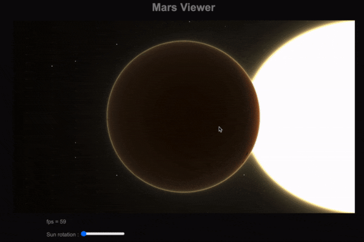

# PlanetViewer

Welcome to **PlanetViewer**, a web application that allows you to explore your favorite planets in the solar system using WebGL and ray marching techniques. **Currently, you can view only the landscapes of Mars**

## Features

- Realistic Visualization: Experience Mars with elevation data from NASA bringing its surface to life.
- WebGL and Ray Marching for realistic graphism.
- Interactive Interface: Navigate and explore the Martian landscape with an intuitive user interface.

## Demo

## Getting Started

The site is hosted on GitHub page and can be visited through this [**link**](https://stantonik.github.io/planerviewer/).

### Prerequisites

- A modern web browser (Chrome, Firefox, Safari, etc.) that supports WebGL2
- Good computer/phone hardware configuration

## Usage

- Open the application in your browser.
- Use the mouse to navigate and explore the surface of Mars.
- Zoom in and out to see different features in detail.

## Technologies Used

- WebGL: For rendering 3D graphics in the browser.
- Ray Marching: A rendering technique to create beautiful and complex visual effects.
- NASA Elevation Data: Retrieved from NASA's data to provide accurate terrain details.

## Acknowledgments

- Inspired by the beauty and mystery of our solar system.

---
